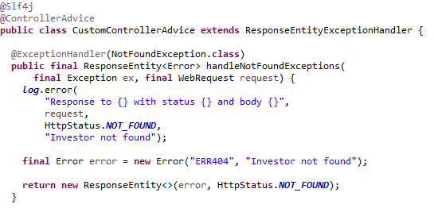

# RESTful API design & best practices

## ¿Qué vamos a ver?

En este apartado se pretende recoger, de manera resumida, los diferentes tipos de patrones y buenas prácticas a la hora de diseñar API RESTful. Además se plantearán algunos ejemplos sobre cómo llevarlos a cabo bajo el framework Spring.

## ¿Qué es una API REST vs API RESTful?

Una API REST es una interfaz que permite acceder a un servicio web mediante peticiones HTTP.

Una API RESTful es más un estilo arquitectónico: un conjunto de principios que las aplicaciones web utilizan para comunicarse entre sí. Las API RESTful están construidas de tal forma que permiten a la aplicación web acceder a los datos y recursos que necesita sin necesidad de conocimientos especiales de programación. 

Algunos de los objetivos son:

- Hacerlas sencillas y fáciles de usar tanto para los desarrolladores como para los usuarios.
- Utilizar patrones, terminología estandar y desarrollar comportamientos homogéneos
- Manejo de errores claro e intuitivo
- Proveer documentación

## Reglas

### URI's para representar recursos

Las URI's son la puerta de entrada para una API REST, por lo que es importante que tengan la estructura correcta.

> *scheme://authority/path[?query]*

Ejemplos:

*https://developers.google.com/identity/protocols/oauth2/web-server?hl=es-419*

ó

Recomendaciones generales:
- Deben definir de forma clara y sencilla la representación del recurso
- Usar sólo minusculas
- No incluir '/' al final de la ruta

#### Scheme

Indica cómo interpretar la parte de la URI después de los ':'. Aunque algunos de los más comunes son http y https, no está asociado a ningún protocolo específico.

[Ver tipos](https://en.wikipedia.org/wiki/List_of_URI_schemes)

#### Authority

Indica quién es el propietario del servicio. Por ejemplo: *en.wikipedia.org*

#### URI path

Indica la ruta completa del recurso

##### Arquetipos de recursos

Los recursos podrían clasificarse en dos arquetipos principales:

- CRUD: incluye aquellos recursos de tipo almacen, coleccion y documento
- ACTIONS: incluye aquellos recursos de tipo controlador

Veamos algunos ejemplos:

CRUD (Create, Read, Update y Delete)

 PENDIENTE

ACTIONS

 PENDIENTE

##### Recomendaciones:
- Evitar el uso de guiones bajos ('_') y puntos ('.') ya que, según donde se visualice, puede superponerse con el subrayado de los links
- Usar '-' en caso de necesitar palabras compuestas
- Utilizar nombres en singular para recursos de tipo documento
- Utilizar nombres en plugar para recursos de tipo almacenes o colecciones
- Utilizar verbos para recursos de tipo controlador junto al método HTTP POST.

#### URI query

Recopila una lista de pares parámetro=valor que serán incluidos en la misma URI

MUY IMPORTANTE: las URI's siempre se envían en claro durante las comunicaciones entre servicios, por lo que SIEMPRE se recomienda evitar usar estos parámetros si se envía información sensible, independientemente de si la comunicación está asegurada con HTTPS o no.

Un uso muy común de estos parámetros está dirigido a la paginación, ordenación y/o filtrado de resultados, como veremos más adelante.

### Metadatos

Los metadatos son otro tipo de información que se envía durante las comunicaciones entre servicios y a los que en ocasiones ni siquiera prestamos atención. A continuación veremos algunos de los más utilizados:

- **Content-type**: indica el formato de la respuesta
- **Content-lenght**: indica el tamaño de los resultados en bytes de manera que el cliente pueda saber con anterioridad si se trata de una llamada muy pesada y podría causarle problemas de performance
- **[ETag](https://es.wikipedia.org/wiki/HTTP_ETag) (Entity Tag)**: hash MD5 proporcionado como una manera de ayudar a prevenir que actualizaciones simultáneas de un recurso se sobrescriban entre sí 
- **Cache**: conjunto de cabeceras que indican el uso o no de sistemas de cache, tales como 'cache-control', 'expires', 'date-response', 'no-cache', etc.
- **Authorization**: envía el token de autorización en el caso de APIs securizadas
- **[Accept-Encoding](https://http.dev/accept-encoding)**: indica los tipos de codificación permitidos 

## Patrones

### Sin estado

Una de principales características de las APIs RESTful es su grado de independencia y escalabilidad, por lo que es importante evitar el uso de sesiones o estados. Esto obligaría a pasar las peticiones de una misma sesión a unas instancias concretas, volviéndolo todo mucho más complejo.

Para ello lo más importante es que en cada petición exista la información necesaria y suficiente requerida para resolverla. Dejaremos en manos de los clientes (frontales/móviles) el control de estas sesiones en caso de que sean necesarias.

### Negociación del contenido

Ofrece la posibilidad de que un cliente pueda solicitar la información de un recurso bajo un formato determinado:

Dos posibles alternativas:
- **Enviando la cabecera**: Accept=application/json
- **Enviando el queryParam**: ?accept=json

En caso de que el formato no sea soportado se recomienda informar debidamente al cliente, por ejemplo devolviendo un error con código *406 - Not Acceptable* y un mensaje de 'Formato no soportado'

 PENDIENTE

### URI templates

Consiste en la utilización de variables durante la construcción de URIs, de forma que sea mucho más práctico e intuitivo para el resto de desarrolladores.

### Paginación

La paginación consiste en devolver un conjunto de resultados en subgrupos llamados páginas. De esta forma nos permite limitar el tamaño de los resultados que estamos obteniendo y no sobrecargar la memoria del cliente.

Otro aspecto importante: la paginación es una representación de un recurso y no un recurso en sí. Por tanto, no cabe la opción de obtener a esta información de la forma */api/../recurso/page/2*. En su lugar sería necesario el uso de queryParams para su obtención */api/../recurso?page=2*.

Existen diferentes formas de implementar la paginación:

- **Offset based**: utilizando parámetros como *offset* y *limit*
- **Time based**: utilizando parámetros como *since* y *until*
- **Cursor based**: utilizando parámetros como *page* y *size*

### Descubrimiento

Provee al cliente de las URI que pueden serles de utilizad para otras operaciones con el recurso.

Por ejemplo, como respuesta a una operación de creación POST, la respuesta podría devolver la siguiente estructura:

Del mismo modo también sería de utilidad limitar aquellos métodos HTTP que no están permitidos (*405 - Method Not Allowed*) para informar al cliente qué operaciones puede y no puede realizar sobre el recurso.

### Errores y logs de excepciones

Es recomendable asociar correctamente el código de error HTTP devuelto con el mensaje mostrado, con el objetivo de evitar malentendidos y ser más transparente de cara al usuario.
Para ello es una práctica común generar excepciones personalizadas que nos permitan identificar correctamente el momento y la causa del error.

### Unicode

Finalmente también es importante el uso correcto del charset, de manera que el conjunto de caracteres devueltos se adecúe a lo solicitado por el cliente (por ejemplo: UTF8)
Esto ayudará a que la API pueda ser internacionalizada.

 PENDIENTE

## Patrones avanzados

## Bibliografía

- [https://restfulapi.net/](https://restfulapi.net/)
- [RESTful API Design Patterns and Best Practices - Harihara Subramanian](https://www.packtpub.com/product/hands-on-restful-api-design-patterns-and-best-practices/9781788992664)
- [https://en.wikipedia.org/wiki/Uniform_Resource_Identifier](https://en.wikipedia.org/wiki/Uniform_Resource_Identifier)
