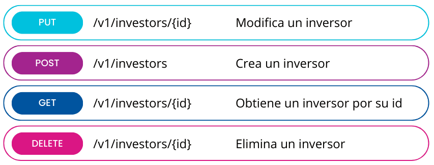

# RESTful API design & best practices

## ¿Qué vamos a ver?

En este apartado se pretende recoger, de manera resumida, los diferentes tipos de patrones y buenas prácticas a la hora de diseñar API RESTful. Además se plantearán algunos ejemplos sobre cómo llevarlos a cabo bajo el framework Spring.

## <a name="index">Índice:</a>
 - [¿Qué es una API REST vs API RESTful?](#what-is)
 - [Reglas](#rules)
 - [Patrones](#patterns)
 - [Patrones avanzados](#advanced-patterns)


## <a name="what-is">¿Qué es una API REST vs API RESTful?</a> [&#8593;](#index) 

Una API REST es una interfaz que permite acceder a un servicio web mediante peticiones HTTP.

Una API RESTful es más un estilo arquitectónico: un conjunto de principios que las aplicaciones web utilizan para comunicarse entre sí. Las API RESTful están construidas de tal forma que permiten a la aplicación web acceder a los datos y recursos que necesita sin necesidad de conocimientos especiales de programación. 

Algunos de los objetivos a alcanzar mediante una API RESTful son:

- Hacerla sencilla y fácil de usar tanto para los desarrolladores como para los usuarios
- Utilizar patrones, terminología estandar y desarrollar comportamientos homogéneos
- Manejo de errores claro e intuitivo
- Proveer documentación

## <a name="rules">Reglas</a> [&#8593;](#index) 

### URI's para representar recursos

Las URI's son la puerta de entrada para una API REST, por lo que es importante que tengan la estructura correcta.

> *scheme://authority/path[?query]*

Ejemplos:

*https://developers.google.com/identity/protocols/oauth2/web-server?hl=es-419*

ó


Recomendaciones generales:
- Deben definir de forma clara y sencilla la representación del recurso
- Usar sólo minusculas
- No incluir '/' al final de la ruta

#### Scheme

Indica cómo interpretar la parte de la URI después de los ':'. Aunque algunos de los más comunes son http y https, no está asociado a ningún protocolo específico.

[Ver tipos](https://en.wikipedia.org/wiki/List_of_URI_schemes)


#### Authority

Indica quién es el propietario del servicio. Por ejemplo: *developers.google.com*

#### URI path

Indica la ruta completa del recurso.

##### Arquetipos de recursos

Los recursos podrían clasificarse en dos arquetipos principales:

- CRUD: incluye aquellos recursos de tipo almacen, coleccion y documento
- ACTIONS: incluye aquellos recursos de tipo controlador

Veamos algunos ejemplos:

CRUD (Create, Read, Update y Delete)



ACTIONS


##### Recomendaciones:
- Evitar el uso de guiones bajos ('_') y puntos ('.') ya que, según donde se visualice, puede superponerse con el subrayado de los links
- Usar '-' en caso de necesitar palabras compuestas
- Utilizar nombres en singular para recursos de tipo documento
- Utilizar nombres en plurar para recursos de tipo almacenes o colecciones
- Utilizar verbos para recursos de tipo controlador junto al método HTTP POST (ejemplo: POST http://server/url-path/resource/action)

#### URI query

Recopila una lista de pares parámetro=valor que serán incluidos en la misma URI

MUY IMPORTANTE: las URI's siempre se envían en claro durante las comunicaciones entre servicios, por lo que SIEMPRE se recomienda evitar usar estos parámetros si se envía información sensible, independientemente de si la comunicación está asegurada con HTTPS o no.

Un uso muy común de estos parámetros está dirigido a la paginación, ordenación y/o filtrado de resultados, como veremos más adelante.


### Metadatos

Los metadatos son otro tipo de información que se envía durante las comunicaciones entre servicios y a los que en ocasiones ni siquiera prestamos atención. A continuación veremos algunos de los más utilizados:


- **Accept**: indica el formato de la petición
- **Content-type**: indica el formato de la respuesta
- **Content-lenght**: indica el tamaño de los resultados en bytes de manera que el cliente pueda saber con anterioridad si se trata de una llamada muy pesada y podría causarle problemas de performance
- **[ETag](https://es.wikipedia.org/wiki/HTTP_ETag) (Entity Tag)**: hash MD5 proporcionado como una manera de ayudar a prevenir que actualizaciones simultáneas de un recurso se sobrescriban entre sí 
- **Cache**: conjunto de cabeceras que indican el uso o no de sistemas de cache, tales como 'Cache-control', 'Expires', 'Date-response', 'Last-Modified', etc.
- **Authorization**: envía el token de autorización en el caso de APIs securizadas
- **[Accept-Encoding](https://http.dev/accept-encoding)**: indica los tipos de codificación permitidos 


## <a name="patterns">Patrones</a> [&#8593;](#index) 

### Sin estado (stateless)

Una de principales características de las APIs RESTful es su grado de independencia y escalabilidad, por lo que es importante evitar el uso de sesiones o estados. Esto obligaría a pasar las peticiones de una misma sesión a unas instancias concretas, volviéndolo todo mucho más complejo.

Para ello lo más importante es que en cada petición exista la información necesaria y suficiente requerida para resolverla. Dejaremos en manos de los clientes (frontales/móviles) el control de estas sesiones en caso de que sean necesarias.

### Uniform contract pattern

El patrón de interfaz uniforme es fundamental para el diseño de cualquier sistema RESTful. Permite simplificar y desacoplar la arquitectura, lo que permite que cada parte evolucione de forma independiente. 

Las principales restricciones de esta interfaz uniforme son:
- Utilización de méthodos HTTP (GET, POST, PUT, PATCH, DELETE)
- Identificación de recursos en las solicitudes.
- Manejo de recursos mediante representaciones
- Mensajes autodescriptivos
- Hipermedia como motor del estado de las aplicaciones (HATEOAS)

### Negociación del contenido

Ofrece la posibilidad de que un cliente pueda solicitar la información de un recurso bajo un formato determinado:


Dos posibles alternativas:
- **Enviando la cabecera**: Accept=application/json
- **Enviando el queryParam**: ?accept=json


En caso de que el formato no sea soportado se recomienda informar debidamente al cliente, por ejemplo devolviendo un error con código *406 - Not Acceptable*.


### URI templates

Consiste en la utilización de variables durante la construcción de URIs, de forma que sea mucho más práctico e intuitivo para el resto de desarrolladores.


### Paginación

La paginación consiste en devolver un conjunto de resultados en subgrupos llamados páginas. De esta forma nos permite limitar el tamaño de los resultados que estamos obteniendo y no sobrecargar la memoria del cliente.

Otro aspecto importante: la paginación es una representación de un recurso y no un recurso en sí. Por tanto, no cabe la opción de obtener a esta información de la forma */api/../recurso/page/2*. En su lugar sería necesario el uso de queryParams para su obtención */api/../recurso?page=2*.

Existen diferentes formas de implementar la paginación:

- **Offset based**: utilizando parámetros como *offset* y *limit*
- **Time based**: utilizando parámetros como *since* y *until*
- **Cursor based**: utilizando parámetros como *page* y *size*


### Descubrimiento - HATEOAS

Provee al cliente de las URI que pueden serles de utilizad para otras operaciones con el recurso.

Por ejemplo, como respuesta a una operación de creación POST, la respuesta podría devolver la siguiente estructura:


Del mismo modo también sería de utilidad limitar aquellos métodos HTTP que no están permitidos (*405 - Method Not Allowed*) para informar al cliente sobre qué operaciones puede y no puede realizar en el recurso.


### Errores y logs de excepciones

Es recomendable asociar correctamente el código de error HTTP devuelto con el mensaje mostrado, con el objetivo de evitar malentendidos y ser más transparente de cara al usuario.
Para ello es una práctica común generar excepciones personalizadas que nos permitan identificar correctamente el momento y la causa del error.


>[CustomControllerAdvice.java](restful-sv/src/main/java/org/example/restful/configuration/CustomControllerAdvice.java)

```
  @ExceptionHandler({InvestorNotFoundException.class, StockNotFoundException.class})
  @ResponseStatus(HttpStatus.NOT_FOUND)
  @ResponseBody
  public final Error handleNotFoundExceptions(final Exception ex, final WebRequest request) {
    log.error(
        "Response to {} with status {} and body {}",
        request,
        HttpStatus.NOT_FOUND,
        ex.getMessage());

    return new Error("ERR404", ex.getMessage());
  }
```

### Caché

La caché es la capacidad de almacenar copias de datos a los que se accede con frecuencia en varios lugares a lo largo de la ruta solicitud-respuesta. 

La optimización de la red mediante el almacenamiento en caché mejora la calidad general del servicio de las siguientes maneras:

- Reduce el ancho de banda
- Reduce la latencia
- Reducir la carga de los servidores
- Ocultar los fallos de la red

Las peticiones GET deberían ser almacenables en caché por defecto, hasta que se dé una condición especial.


>[StockControllerImpl.java](restful-sv/src/main/java/org/example/restful/adapter/rest/v1/controller/StockControllerImpl.java)

```
  @Override
  @RolesAllowed({USER, ADMIN})
  @Cacheable(value = "allstocks")
  @GetMapping(value = SUBPATH, produces = MediaType.APPLICATION_JSON_VALUE)
  public ResponseEntity<List<StockResponse>> getAllStocks() {
    log.info("Getting all stocks");

    final List<StockResponse> responses = responseConverter.convert(stockService.getAllStocks());

    return ResponseEntity.ok()
        .cacheControl(CacheControl.maxAge(cacheTTL.getAllStocksTTL(), TimeUnit.MILLISECONDS))
        .lastModified(Instant.now())
        .body(responses);
  }
```

### Unicode

Finalmente también es importante el uso correcto del charset, de manera que el conjunto de caracteres devueltos se adecúe a lo solicitado por el cliente (por ejemplo: UTF-8).
Esto ayudará a que la API pueda ser internacionalizada.


## <a name="advanced-patterns">Patrones avanzados</a> [&#8593;](#index) 

### Versionado

Es muy dificil afirmar que una API va a mantenerse intacta a lo largo de su vida sin necesidad de ningún cambio. En el caso de cambios menores, corrección de errores, etc. no sería necesario un versionado del mismo. Sin embargo, para cambios importantes o que pudieran resultar incompatibles con el funcionamiento de la versión anterior se recomienda anotar con versiones cada uno de los comportamientos.

A continuación veremos diferentes formas de versionar una API:

- Mediante URI path: *http://localhost/v2/resource*
- Mediante query parameter: *?version=2.0*
- Mediante custom headers: *x-resource-version=2.0*
- Mediante content-negociation: *Accept=application/resource-v2.0+json*


Quedará en manos del negocio la decisión de durante cuanto tiempo se deberán mantener versiones antiguas de un *endPoint* y el momento oportuno para darlo totalmente de baja.

### Seguridad

Un aspecto importante en las APIs RESTful es la seguridad. A continuación enumeraremos algunos de los puntos más importantes:

- Política de mínimos permisos (@RolesAllowed)
- Hazlo simple. Cuanto más 'innecesariamente' compleja es una solución, más facil es dejar abierta alguna brecha
- Siempre usar el protocolo HTTPs para asegurar las conexiones
- Utiliza contraseñas con hash
- Nunca exponer información sensible en las URLs tales como usuarios, contraseñas, tokens, etc. tal y como ya comentamos en el apartado [URI query](#uri-query)
- Considera el uso de OAuth en lugar de la autenticación básica (aunque ésta sea suficiente)
- Valida los parámetros de entrada (@Valid)

>[InvestorControllerImpl.java](restful-sv/src/main/java/org/example/restful/adapter/rest/v1/controller/InvestorControllerImpl.java)

```
  @Override
  @RolesAllowed({USER, ADMIN})
  @PostMapping(value = SUBPATH,
               consumes = MediaType.APPLICATION_JSON_VALUE,
               produces = MediaType.APPLICATION_JSON_VALUE)
  public ResponseEntity<InvestorResponse> createInvestor(
      @Valid @RequestBody final InvestorRequest investorRequest) throws Exception {

    final Investor investor =
        investorService.createInvestor(requestConverter.convert(investorRequest));

    final InvestorResponse response = responseConverter.convert(investor);

    return ResponseEntity.status(HttpStatus.CREATED).body(response);
  }
```

### Entity endpoints

Se define como *Entity endpoint* al acceso individual a entidades SIN dependencias. De este modo no sería necesario controlar o actualizar entidades asociadas por lo que el mantenimiento del recurso se realizaría de una forma mucho más sencilla.

### Redirecciones

Aquellos endpoints que quedaran obsoletos o temporalmente inutilizables deberían comunicar correctamente esta situación y, en caso de que sea posible, proveer una alternativa al cliente. De este modo podríamos devolver un error HTTP *301 - Permanent redirect* o *307 - Temporary redirect* e incluir la cabecera *location* con la url alternativa.

>[InvestorControllerImpl.java](restful-sv/src/main/java/org/example/restful/adapter/rest/v1/controller/InvestorControllerImpl.java)

```
  @Override
  @Deprecated
  @RolesAllowed(ADMIN)
  @GetMapping(value = SUBPATH)
  public ResponseEntity<List<InvestorResponse>> getAllInvestors() {

    return ResponseEntity.status(HttpStatus.PERMANENT_REDIRECT)
        .location(
            UriComponentsBuilder.newInstance()
                .path(NEW_PATH.concat(SUBPATH))
                .query("page=0&size=3")
                .build()
                .toUri())
        .build();
  }
```

Este patrón permite al cliente poder recuperarse y finalizar la operación de forma satisfactoria. En nuestro caso de ejemplo, la propia interface de Swagger ya se encarga de redireccionar y devolver los resultados desde la url alternativa:


### Idempotencia

La idempotencia es una característica basada en que ante una misma petición, la respuesta debería ser idéntica. Este patrón viene a solucionar sobre todo ciertos problemas de concurrencia o de peticiones repetidas. Por defecto los métodos GET, PUT y DELETE son considerados idempotentes, al contrario que los métodos POST y PATCH. 

En la mayoría de casos podría ser suficiente con adaptar algunos endpoints de manera que siempre devuelvan la misma respuesta. Un [ejemplo](restful-sv/src/main/java/org/example/restful/service/InvestorService.java) podría ser una petición DELETE que elimine un inversor: si el inversor existe lo elimina y si ya fue eliminado anteriormente no hace nada. De este modo el cliente no tendrá que preocuparse en caso de recibir un error por inversor no encontrado ya que no le aporta ningún valor.

En caso de que sea necesario puede hacerse uso de la cabecera ETag para validar si el resultado sigue siendo el mismo. De lo contrario se recomendaría notificar al cliente mediante un error HTTP *409 - Conflict*

### Operaciones bulk

Una operación 'bulk' se diferencia de una operación 'batch' en que la primera es una operación única con múltiples objetos y la segunda son múltiples operaciones con múltiples objetos.

Pongamos varios ejemplos:

- Bulk: registrar varias acciones a un inversor
- Batch: registrar varias acciones a varios inversores (por ejemplo en el caso de que el valor de las acciones baje de precio)

Para ello es posible utilizar el método PATCH del recurso de manera que el body provea el listado de objetos a incorporar.

Este tipo de operaciones pueden conllevar una baja performance por lo que podría ser necesario resolverlos de forma asíncrona (devolviendo *202 - Accepted*) o mediante la implementación de flujos en paralelo para una respuesta más rápida.

### Circuit breaker

El patrón '[circuit breaker](https://microservices.io/patterns/reliability/circuit-breaker.html)' proporciona una capa de control de cara a posibles ataques DoS (Denegación de Servicio) y/o respuesta rápida ante posibles pérdidas de servicio.

### Reintentos

El patrón de reintentos tiene como objetivo lograr la estabilidad del sistema y trata de lograr el éxito de una llamada a otra, tratando que el sistema haga lo mejor que pueda para responder adecuadamente.

Cuando se realiza una petición a una instancia, y esta falla por estar ocupada temporalmente (503), como caso particular el reintento debe realizarse en un período espaciado de tiempo, pues los reintentos continuos pueden traer consigo que la instancia se mantenga ocupada más tiempo (respondiendo que está ocupada) y no pueda procesar las nuevas solicitudes.

El patrón de reintentos debe usarse cuando se interactua con sistemas externos que pueden llegar a un estado de fallos temporales y afectar la estabilidad de la plataforma.

### BTF (Backend to Frontend)

Existe una problemática específica para las aplicaciones multiplataforma: aquellas que tienen una web y una app movil ligera. En estos casos, por ejemplo, la app podría necesitar menos información y una mejor performance que la que pudiera resolver la web. Por ello se propone la implementación de interfaces especializadas para cada uno de los clientes (*/api/web/resource* vs */api/app/resource*). Esto puede resultar controvertido dadas las ventajas e inconvenientes que conlleva:

**Ventajas:**
- Permite tener una representación de los recursos más reducida para aquellos clientes que no necesiten tanta información 
- Podríamos mejorar la performance para estos clientes que necesitaran una respuesta mucho más rápida

**Inconvenientes:**
- Sería necesario mantener ambas interfaces con un comportamiento muy similar

### API first

Se trata de una metodología de definición de APIs que prioriza la definición del contrato antes de empezar a lanzar el resto de procesos, como la implementación, testing, despliegue,...

Sus principales ventajas son:

- Reduce el time to market casi un 50%.
- Mejora la calidad de la API puesto que permite que los consumidores puedan empezar a trabajar con el contrato sin haberse implementado y por tanto, es más susceptibles a cambios
- Mejora los procesos: Del primer contrato se suelen automatizar el resto de fases, lo que hace que se automaticen los procesos.
- Permite generar contract tests. Permite autogenerar las pruebas para los equipos de QA y desarrollo y además, que los equipos de Desarrollo puedan probarse con los tests realizados en QA
- Mejora la seguridad. Al definir el contrato primero, permite validar la seguridad basada en la definición y encontrar bugs de seguridad antes de haber empezado a implementar nada.

La metodología se implementa en 3 fases:

- Fase de definición y mocking: Se define el contrato openapi, se valida y se genera un mocking para los clientes.
- Fase de implementación: Gracias al contrato, desarrollamos tres actividades en paralelo:
  * Definición de los tests: Se desarrollan los tests utilizando el mock server mientras que los desarrolladores terminan la implementación
  * Desarrollo e implementación de la API: Utilizando herramientas de generación de arquetipos, como APIGen, generamos y desarrollamos la implementación de la API. Una vez desarrollada la API, se probarán con los tests automatizados por QA.
  * Consumo de la API: Las apis se exponen a traves de las herramientas de api management apuntando al mock server, lo que le permite a los consumidores empezar a probar y desarrollar la funcionalidad y mejorar el contrato api conjuntamente con el desarrollador de la API.
- Fase de integración: Una vez implementada la API debemos reapuntar la API del mockserver a la implementación realizada. 

## Bibliografía

- [https://restfulapi.net/](https://restfulapi.net/)
- [Representational state transfer](https://en.wikipedia.org/wiki/Representational_state_transfer)
- [RESTful API Design Patterns and Best Practices - Harihara Subramanian](https://www.packtpub.com/product/hands-on-restful-api-design-patterns-and-best-practices/9781788992664)
- [URI](https://en.wikipedia.org/wiki/Uniform_Resource_Identifier)
- [Spring HATEOAS](https://www.baeldung.com/spring-hateoas-tutorial)
- [Spring JPA pagination](https://www.baeldung.com/spring-data-jpa-pagination-sorting)
- [Swagger annotations](https://www.baeldung.com/spring-rest-openapi-documentation)
- [API first](https://cloudappi.net/metodologia-api-first/)
