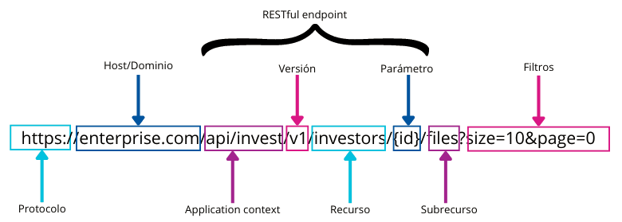

# RESTful API design & best practices

## ¿Qué vamos a ver?

En este apartado se pretende recoger, de manera resumida, los diferentes tipos de patrones y buenas prácticas a la hora de diseñar API RESTful. Además se plantearán algunos ejemplos sobre cómo llevarlos a cabo bajo el framework Spring.

## <a name="index">Índice:</a>
 - [¿Qué es una API vs API REST vs API RESTful?](#what-is)
 - [Buenas prácticas](#best-practices)
     + Nomenclatura consistente
     + Eficiencia
     + Seguridad
     + Versionado
     + Manejo de errores
     + Documentación
 - [API first](#api-first)
 - [Bibliografía](#bibliography)


## <a name="what-is">¿Qué es una API vs REST vs API RESTful?</a> [&#8593;](#index) 

Una [API](https://es.wikipedia.org/wiki/API) es un conjunto de reglas y protocolos que permite a diferentes sistemas de software comunicarse entre sí y que compartan información y funcionalidades.

- Orientado a máquinas, no a usuarios
- No está atado a un lenguaje de programación
- Permite desacoplar, escalar y reutilizar sistemas

Existen muchos tipos de APIs. Algunas de las más utilizadas pueden ser:


[REST](https://es.wikipedia.org/wiki/Transferencia_de_Estado_Representacional) es un estilo de arquitectura software para servicios web con las siguientes restricciones:

- Arquitectura cliente-servidor a través de protocolo HTTP
- Sin estado, permite una mayor escalabilidad
- Interface uniforme bien definida. Cada recurso proporciona:
  + Identificación: URL
  + Manipulación: uso de formatos JSON, XML, HTML, …
  + Mensajes autodescriptivos: nombre del recurso, métodos HTTP y metadatos
  + Hipervínculos: HATEOAS, representa cómo cambiar el estado de un recurso
- Cacheable, permite una mejor eficiencia


La palabra RESTful describe a aquellas APIs o servicios que se adhieren a los principios REST. Para ello una API RESTful debe seguir las reglas definidas por REST.

Sólo con las restricciones vistas en el punto anterior aún queda todo bastante abierto a la interpretación de cada desarrollador. Por ello, aunque no hay un estándar claro aceptado por la comunidad, sí se hace necesario detallar unas buenas prácticas que ayuden a obtener APIs RESTful de calidad.

Para ello tendremos en cuenta los siguientes objetivos:
- Hacerla fácil de usar para los desarrolladores. La calidad de una API es directamente proporcional a la facilidad de su integración.
- Utilizar patrones, terminología estándar y desarrollar comportamientos homogéneos
- Manejar los errores de manera clara e intuitiva
- Proveer documentación


## <a name="best-practices">Buenas prácticas</a> [&#8593;](#index) 

### Nomenclatura consistente

##### URI's para representar recursos

Las URI's son la puerta de entrada para una API REST, por lo que es importante que tengan la estructura correcta.



Recomendaciones generales:
- Claridad: Deben definir de forma clara y sencilla la representación del recurso.
- Legibilidad: Usar sólo minusculas, evitar guiones bajos (‘_’) y puntos (‘.’) y si es necesario, usar (‘-’) en palabras compuestas (kebab-case).
- Homogeneidad: Recursos en plural, acordar terminología (id, bookId, idBook, ...) y no incluir barra (‘/’) al final de la ruta.
- Seguridad: Nunca enviar información sensible en los parámetros, independientemente de si se usa HTTPS.


##### Modelado de recursos

Un recurso es un conjunto de datos que vamos a servir desde nuestra API RESTful.

El manejo de recursos deberá realizarse mediante representaciones, es decir, las peticiones y respuestas pueden ser un subconjunto de datos del recurso. De esta manera controlaremos también los datos a los que cada usuario/rol está autorizado.

Sobre cada recurso permitiremos realizar diferentes tipos de operaciones:

- CRUD
- ACTIONS: Definen una acción particular realizada sobre el recurso, utilizando el método POST y terminando en verbo.

Veamos algunos ejemplos:

**CRUD** (Create, Read, Update y Delete)


**ACTIONS**


##### Negociación del contenido

Ofrece la posibilidad de que un cliente pueda solicitar la información de un recurso bajo un formato o idioma determinado:

Se puede manejar de diferentes formas:
- **Mediante cabeceras**: Accept=application/json ó Accept-language=ES_es
- **Mediante url**: /api/invest/v1/investors/20423.json
- **Mediante queryParams**: ?accept=json ó ?accept-language=ES_es


En caso de que el formato no sea soportado se recomienda informar debidamente al cliente, por ejemplo devolviendo un error con código *406 - Not Acceptable*.


### Eficiencia

##### Paginación

Estrategia diseñada para devolver un subconjunto de datos de un recurso en lugar de su totalidad. Por tanto se consideraría una representación de recursos, no un recurso en sí.

Beneficios:
- Mejor performance
- Mayor fiabilidad ante sobrecargas

La respuesta debería devolver un código *200 - Ok*, si se obtienen todos los recursos disponibles, ó *206 - Partial Content*, si se obtiene sólo una parte

Existen diferentes formas de implementar la paginación:

- **Cursor based**: utilizando parámetros como *page* y *size*
- **Time based**: utilizando parámetros como *since* y *until*
- **Offset based**: utilizando parámetros como *offset* y *limit*

>[InvestorControllerV2Impl.java](restful-sv/src/main/java/org/example/restful/adapter/rest/v2/controller/InvestorControllerV2Impl.java)

```
  @GetMapping(value = INVESTORS_SUBPATH, produces = MediaType.APPLICATION_JSON_VALUE)
  public ResponseEntity<InvestorResponsePage> getAllInvestors(
      final Optional<Long> offset, final Optional<Integer> limit) {

    final Pageable pageable = getPageable(offset, limit);

    final Page<Investor> resultPage = investorService.getAllInvestors(pageable);

    return ResponseEntity.status(calculateStatus(resultPage))
        .body(
            InvestorResponsePage.builder()
                .data(resultPage.map(converter::convert).stream().collect(Collectors.toList()))
                .pagination(
                    getPagination(
                        offset.orElse(PAGINATION_DEFAULT_OFFSET),
                        limit.orElse(PAGINATION_DEFAULT_LIMIT),
                        resultPage.getTotalElements()))
                .build());
  }

  private HttpStatus calculateStatus(final Page<Investor> resultPage) {
    return resultPage.getTotalElements() > resultPage.getSize()
        ? HttpStatus.PARTIAL_CONTENT
        : HttpStatus.OK;
  }
```

#### Caché

La caché es la capacidad de almacenar copias de datos a los que se accede con frecuencia en varios lugares a lo largo de la ruta solicitud-respuesta. 

La optimización de la red mediante el almacenamiento en caché mejora la calidad general del servicio de las siguientes maneras:

- Reduce el ancho de banda
- Reduce la latencia
- Reducir la carga de los servidores
- Ocultar los fallos de la red

Las peticiones GET deberían ser almacenables en caché por defecto, hasta que se dé una condición especial o hasta que el recurso sea modificado.


>[InvestorControllerImpl.java](restful-sv/src/main/java/org/example/restful/adapter/rest/v1/controller/InvestorControllerImpl.java)

```
  @Cacheable(value = "investor")
  @GetMapping(
      value = INVESTORS_SUBPATH + ID_PATH_PARAM,
      produces = {MediaType.APPLICATION_JSON_VALUE, MediaType.APPLICATION_XML_VALUE})
  public ResponseEntity<InvestorResponse> getInvestor(@PathVariable final Long id) {
  
    log.info("Getting investor {}", id);

    final InvestorResponse response = responseConverter.convert(investorService.getInvestorById(id));

    return ResponseEntity.ok()
        .lastModified(Instant.now())
        .body(response);
  }
  
  @CacheEvict(value = "investor", key = "#id")
  @PutMapping(
      value = INVESTORS_SUBPATH + ID_PATH_PARAM,
      consumes = MediaType.APPLICATION_JSON_VALUE)
  public ResponseEntity updateInvestor(
      @PathVariable final Long id, @RequestBody final InvestorRequest investorRequest) {
    
    log.info("Updating investor {}", id);

    investorService.updateInvestor(id, requestConverter.convert(investorRequest));

    return ResponseEntity.status(HttpStatus.NO_CONTENT).build();
  }
```


#### Operaciones asíncronas

Una forma de mejorar la eficiencia de nuestra API RESTful es trabajar de forma asíncrona en aquellas operaciones que resulten muy pesadas.

Pongamos varios ejemplos:

- Bulk: registrar varias acciones sobre un recurso
- Batch: registrar varias acciones sobre varios recursos

Para ello es posible utilizar el método PATCH de manera que el payload se provea del listado de operaciones a realizar.

En este caso podemos devolver el estado *202 - Accepted* de modo que el usuario pueda consultar más tarde su situación.


>[TradingControllerImpl.java](restful-sv/src/main/java/org/example/restful/adapter/rest/v1/controller/TradingControllerImpl.java)

```
  @PatchMapping(
      value = INVESTORS_SUBPATH + PURCHASE_ACTION,
      consumes = MediaType.APPLICATION_JSON_VALUE)
  public ResponseEntity<Void> batchPurchase(
      @Valid @RequestBody final List<PurchaseBatchRequest> purchaseRequests) {

    runAsync(
        () ->
            purchaseRequests.stream()
                .forEach(
                    request ->
                        tradingService.purchase(
                            request.getInvestorId(), requestBatchConverter.convert(request))));

    return ResponseEntity.status(HttpStatus.ACCEPTED).build();
  }
```

#### Idempotencia

La idempotencia es una característica basada en que ante una misma petición, la respuesta debería ser idéntica. Este patrón viene a solucionar sobre todo ciertos problemas de concurrencia o de peticiones repetidas. Por defecto los métodos GET, PUT y DELETE son considerados idempotentes, al contrario que los métodos POST y PATCH. 

En la mayoría de casos podría ser suficiente con adaptar algunos endpoints de manera que siempre devuelvan la misma respuesta. Un [ejemplo](restful-sv/src/main/java/org/example/restful/service/InvestorService.java) podría ser una petición DELETE que elimine un inversor: si el inversor existe lo elimina y si ya fue eliminado anteriormente no hace nada. De este modo el cliente no tendrá que preocuparse en caso de recibir un error por inversor no encontrado ya que no le aporta ningún valor.

En caso de que sea necesario puede hacerse uso de la cabecera ETag para validar si el resultado sigue siendo el mismo. De lo contrario se recomendaría notificar al cliente mediante un error HTTP *409 - Conflict*


#### BTF (Backend to Frontend)

Existe una problemática específica para las aplicaciones multiplataforma: aquellas que tienen una web y una app movil ligera. En estos casos, por ejemplo, la app podría necesitar menos información y una mejor performance que la que pudiera resolver la web. Por ello se propone la implementación de interfaces especializadas para cada uno de los clientes (*/api/web/resource* vs */api/app/resource*). Esto puede resultar controvertido dadas las ventajas e inconvenientes que conlleva:

**Ventajas:**
- Permite tener una representación de los recursos más reducida para aquellos clientes que no necesiten tanta información 
- Podríamos mejorar la performance para estos clientes que necesitaran una respuesta mucho más rápida

**Inconvenientes:**
- Sería necesario mantener ambas interfaces con un comportamiento muy similar


### Seguridad

Un aspecto importante en las APIs RESTful es la seguridad. A continuación enumeraremos algunos de los puntos más importantes:

- Política de mínimos permisos (@RolesAllowed ó @PreAuthorize)
- Hazlo simple. Cuanto más 'innecesariamente' compleja es una solución, más facil es dejar abierta alguna brecha
- Siempre usar el protocolo HTTPs para asegurar las conexiones
- Utiliza contraseñas con hash
- Nunca exponer información sensible en las URLs tales como usuarios, contraseñas, tokens, etc.
- Considera el uso de OAuth en lugar de la autenticación básica (aunque ésta sea suficiente)
- Valida los parámetros de entrada (@Valid) y gestiona correctamente los datos que vas a devolver

>[InvestorControllerImpl.java](restful-sv/src/main/java/org/example/restful/adapter/rest/v1/controller/InvestorControllerImpl.java)

```
  @RolesAllowed({USER, ADMIN})
  @PostMapping(value = INVESTORS_SUBPATH,
               consumes = MediaType.APPLICATION_JSON_VALUE,
               produces = MediaType.APPLICATION_JSON_VALUE)
  public ResponseEntity<InvestorResponse> createInvestor(
      @Valid @RequestBody final InvestorRequest investorRequest) throws Exception {

    final Investor investor =
        investorService.createInvestor(requestConverter.convert(investorRequest));

    final InvestorResponse response = responseConverter.convert(investor);

    return ResponseEntity.status(HttpStatus.CREATED).body(response);
  }
```


### Versionado

Es casi imposible afirmar que una API va a mantenerse intacta a lo largo de su vida sin necesidad de ningún cambio. En el caso de cambios menores, corrección de errores, etc. quizás no sea necesario un versionado del mismo. Sin embargo, para cambios importantes o que pudieran resultar incompatibles con el funcionamiento anterior se recomienda anotar con versiones cada uno de los comportamientos.

A continuación veremos diferentes formas de versionar una API:

- Mediante URI path: */v2/resource*
- Mediante query parameter: *?version=2.0*
- Mediante custom headers: *x-resource-version=2.0*
- Mediante content-negociation: *Accept=application/resource-v2.0+json*


Quedará en manos del negocio la decisión de durante cuanto tiempo se deberán mantener versiones antiguas de un *endPoint* y el momento oportuno para darlo totalmente de baja, aunque se recomienda no tener más de dos versiones activas de un mismo recurso.


##### Redirecciones

Aquellos endpoints que quedaran obsoletos o temporalmente inutilizables deberían comunicar su situación inmediatamente a los posibles clientes. En casos excepcionales sería posible proveer una alternativa de modo que devolviéramos un error HTTP *301 - Permanent redirect* o *307 - Temporary redirect* e incluir la cabecera *location* con la url alternativa.

>[InvestorControllerImpl.java](restful-sv/src/main/java/org/example/restful/adapter/rest/v1/controller/InvestorControllerImpl.java)

```
  @Deprecated
  @RolesAllowed(ADMIN)
  @GetMapping(value = INVESTORS_SUBPATH)
  public ResponseEntity<List<InvestorResponse>> getAllInvestors() {

    return ResponseEntity.status(HttpStatus.PERMANENT_REDIRECT)
        .location(
            UriComponentsBuilder.newInstance()
                .path(BASE_PATH_V2.concat(INVESTORS_SUBPATH))
                .query("offset=" + PAGINATION_DEFAULT_OFFSET + "&limit=" + PAGINATION_DEFAULT_LIMIT)
                .build()
                .toUri())
        .build();
  }
```

Este patrón permite al cliente poder recuperarse y finalizar la operación de forma satisfactoria. En nuestro caso, si realizamos la operación con la propia interface de Swagger ésta ya se encarga de redireccionar y devolver los resultados desde la url alternativa.


### Manejo de errores

Es recomendable asociar correctamente un código de error HTTP devuelto con el mensaje mostrado, con el objetivo de evitar malentendidos y ser más transparente de cara al usuario.
Para ello es una práctica común generar excepciones personalizadas que nos permitan identificar correctamente el momento y la causa del error.

>[CustomControllerAdvice.java](restful-sv/src/main/java/org/example/restful/configuration/CustomControllerAdvice.java)

```
  @ExceptionHandler({InvestorNotFoundException.class, StockNotFoundException.class})
  @ResponseStatus(HttpStatus.NOT_FOUND)
  @ResponseBody
  public final Error handleNotFoundExceptions(final Exception ex, final WebRequest request) {
    log.error(
        "Response to {} with status {} and body {}",
        request,
        HttpStatus.NOT_FOUND,
        ex.getMessage());

    return new Error("ERR404", ex.getMessage());
  }
```

Del mismo modo, por motivos de seguridad, tambien es importante no mostrar información sensible demasiado detallada en estos mensajes por las siguientes razones:
- En caso de una brecha de seguridad, un atacante podría explotar la información obtenida en estas respuestas, ya sean trazas, identificadores, etc.
- Normalmente estos mensajes pueden ser almacenados en ficheros de logs en claro, dejando los datos expuestos para ser explotados más tarde.

```
	GET /api/invest/v1/investors/10 HTTP/1.1
	Accept: application/json
	Authorization: Basic YWRtaW46YWRtaW4=
	User-Agent: PostmanRuntime/7.37.3
	Cache-Control: no-cache
	Postman-Token: b001b2a0-5707-4ac2-a596-d05b05eabee8
	Host: localhost:8080
	Connection: keep-alive
	Cookie: JSESSIONID=B3CC2DAD5A5772621C26C56373598B6B
	 
	HTTP/1.1 404 Not Found
	Content-Type: application/json
	Date: Thu, 18 Apr 2024 08:53:50 GMT
	 
	{"code":"ERR404","message":"Investor not found"}
```

Como en todo, la clave está en el equilibrio.


### Documentación

##### Swagger


##### Descubrimiento

También conocido como HATEOAS (Hypermedia As The Engine Of Application State). Provee un listado de URL’s con las operaciones que se permiten realizar sobre el recurso. En algunas situaciones resulta interesante utilizar esta solución dado que el cliente no necesitaría conocer de antemano las operaciones que puede realizar sobre un recurso, y podría utilizar aquellas que se le proveen.

Por ejemplo, como respuesta a una operación de creación POST, la respuesta podría devolver el siguiente *payload*:

```
{
    "id": 1,
    "idNumber": "76245691H",
    "name": "Manuel Rodriguez",
    "age": 37,
    "country": "SPAIN",
    "_links": {
        "get": {
            "href": "http://localhost:8080/api/invest/v1/investors/1"
        },
        "put": {
            "href": "http://localhost:8080/api/invest/v1/investors/1"
        },
        "delete": {
            "href": "http://localhost:8080/api/invest/v1/investors/1"
        }
    }
}
```

Del mismo modo también es de utilidad limitar aquellos métodos HTTP que no están permitidos (*405 - Method Not Allowed*) para informar al cliente sobre qué operaciones puede y no puede realizar en el recurso.

```
	PATCH /api/invest/v1/investors/1 HTTP/1.1
	Content-Type: application/json
	Authorization: Basic YWRtaW46YWRtaW4=
	User-Agent: PostmanRuntime/7.37.3
	Accept: */*
	Cache-Control: no-cache
	Postman-Token: 94b04d17-fd4b-4c54-8705-9665a9a490b1
	Host: localhost:8080
	Accept-Encoding: gzip, deflate, br
	Connection: keep-alive
	Content-Length: 2
	Cookie: JSESSIONID=2B4AEBDAA01609D9181B8DBAD4ACCFDB
	 
	{}
	 
	HTTP/1.1 405 Method Not Allowed
	Allow: GET,PUT,DELETE
	Date: Thu, 18 Apr 2024 08:50:01 GMT
```

## <a name="api-first">API first</a> [&#8593;](#index)

Se trata de una metodología de definición de APIs que prioriza la definición del contrato antes de empezar a lanzar el resto de procesos, como la implementación, testing, despliegue,...

Sus principales ventajas son:

- Reduce el time to market casi un 50%.
- Mejora la calidad de la API puesto que permite que los consumidores puedan empezar a trabajar con el contrato sin haberse implementado y por tanto, es más susceptibles a cambios
- Mejora los procesos: Del primer contrato se suelen automatizar el resto de fases, lo que hace que se automaticen los procesos.
- Permite generar contract tests. Permite autogenerar las pruebas para los equipos de QA y desarrollo y además, que los equipos de Desarrollo puedan probarse con los tests realizados en QA
- Mejora la seguridad. Al definir el contrato primero, permite validar la seguridad basada en la definición y encontrar bugs de seguridad antes de haber empezado a implementar nada.

La metodología se implementa en 3 fases:

- Fase de definición y mocking: Se define el contrato openapi, se valida y se genera un mocking para los clientes.
- Fase de implementación: Gracias al contrato, desarrollamos tres actividades en paralelo:
  * Definición de los tests: Se desarrollan los tests utilizando el mock server mientras que los desarrolladores terminan la implementación
  * Desarrollo e implementación de la API: Utilizando herramientas de generación de arquetipos, como APIGen, generamos y desarrollamos la implementación de la API. Una vez desarrollada la API, se probarán con los tests automatizados por QA.
  * Consumo de la API: Las apis se exponen a traves de las herramientas de api management apuntando al mock server, lo que le permite a los consumidores empezar a probar y desarrollar la funcionalidad y mejorar el contrato api conjuntamente con el desarrollador de la API.
- Fase de integración: Una vez implementada la API debemos reapuntar la API del mockserver a la implementación realizada. 


## <a name="bibliography">Bibliografía</a> [&#8593;](#index)

- [https://restfulapi.net/](https://restfulapi.net/)
- [Representational state transfer](https://en.wikipedia.org/wiki/Representational_state_transfer)
- [RESTful API Design Patterns and Best Practices - Harihara Subramanian](https://www.packtpub.com/product/hands-on-restful-api-design-patterns-and-best-practices/9781788992664)
- [URI](https://en.wikipedia.org/wiki/Uniform_Resource_Identifier)
- [Spring HATEOAS](https://www.baeldung.com/spring-hateoas-tutorial)
- [Spring JPA pagination](https://www.baeldung.com/spring-data-jpa-pagination-sorting)
- [Swagger annotations](https://www.baeldung.com/spring-rest-openapi-documentation)
- [API first](https://cloudappi.net/metodologia-api-first/)
- [API design interview questions](https://blog.postman.com/api-design-interview-questions/)
- [API documentation](https://apichangelog.substack.com/p/five-elements-of-good-api-documentation)