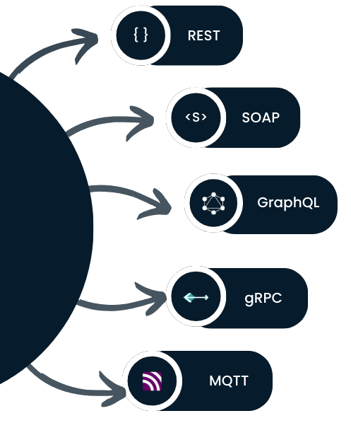

# RESTful API design & best practices

*Lee este documento en [español](https://github.com/peterm85/restful-api-design/blob/master/README.md)*

## What’s this all about?

This section aims to summarize the different types of patterns and best practices when designing RESTful APIs. In addition, some examples of how to carry them out under the Spring framework will be presented.

## <a name="index">Index:</a>
 - [What is an API vs REST API vs RESTful API?](#what-is)
 - [Best practices](#best-practices)
     + Consistent naming
     + Performance
     + Security
     + Versioning
     + Error handling
     + Documentation
 - [API first](#api-first)
 - [Bibliography](#bibliography)


## <a name="what-is">What is an API vs REST API vs RESTful API?</a> [&#8593;](#index) 

An [API](https://en.wikipedia.org/wiki/API) is a set of rules and protocols that allows different software systems to communicate with each other and share information and functionality.

- Machine-oriented, not user-oriented
- Not tied to a programming language
- Allows decoupling, scaling and reuse of systems.

There are many types of APIs. Some of the most widely used are:




[REST](https://en.wikipedia.org/wiki/REST) is a software architecture style for web services with the following restrictions:

- Client-server architecture via HTTP protocol.
- Stateless, allowing for greater scalability
- Well-defined uniform interface. Each resource provides:
  + Identification: URL
  + Manipulation: use of JSON, XML, HTML, ... formats.
  + Self-descriptive messages: resource name, HTTP methods and metadata.
  + Hyperlinks: HATEOAS, represents how to change the state of a resource.
- Cacheable, allows better performance


The word RESTful describes those APIs or services that adhere to REST principles. To do so, a RESTful API must follow the rules defined by REST.

Only with the restrictions seen in the previous point everything is still quite open to the interpretation of each developer. Therefore, although there is no clear standard accepted by the community, it is necessary to detail some good practices that help to obtain quality RESTful APIs.

To do so, we will take into account the following objectives:
- Make it easy to use for developers. The quality of an API is directly proportional to the ease of integration.
- Use patterns, standard terminology and develop homogeneous behaviors.
- Handle errors in a clear and intuitive way.
- Provide documentation


## <a name="best-practices">Best practices</a> [&#8593;](#index) 

### Consistent naming

##### URI's to represent resources

URIs are the gateway to a REST API, so it is important that they have the right structure.


General recommendations:
- Clarity: They should clearly and simply define the representation of the resource.
- Legibility: Use only lower case, avoid underscores ('_') and periods ('.') and if necessary, use ('-') in compound words (kebab-case).
- Homogeneity: Resources in plural, agree on terminology (id, bookId, idBook, ...) and do not include slash ('/') at the end of the path.
- Security: Never send sensitive information in the parameters, regardless of whether HTTPS is used.


##### Resources modeling

A resource is a set of data that we are going to serve from our RESTful API.

Resource management should be done through representations, i.e. requests and responses can be a subset of the resource data. In this way we will also control the data to which each user/role is authorized.

Different types of operations can be performed on each resource:

- CRUD
- ACTIONS: They define a particular action performed on the resource, using the POST method and ending in verb.

Let's see some examples:

**CRUD** (Create, Read, Update y Delete)


**ACTIONS**


##### Content negotiating

It offers the possibility for a client to request the information of a resource in a specific format or language:

It can be handled in different ways:
- By headers**: Accept=application/json or Accept-language=ES_es
- Through url**: /api/invest/v1/investors/20423.json
- By queryParams**: ?accept=json or ?accept-language=ES_es


In case the format is not supported, it is recommended to inform the customer accordingly, for example by returning an error code *406 - Not Acceptable*.


### Performance

##### Pagination

A strategy designed to return a subset of a resource's data rather than its entirety. It would therefore be considered a representation of resources, not a resource itself.

Benefits:
- Better performance.
- Improved reliability on overloads

The response should return a code *200 - Ok*, if all available resources are fetched, or *206 - Partial Content*, if only a part is fetched

There are different ways to implement paging:

- **Cursor based**: using parameters such as *page* and *size*.
- **Time based**: using parameters like *since* and *until*.
- **Offset based**: using parameters such as *offset* and *limit*

>[InvestorControllerV2Impl.java](restful-sv/src/main/java/org/example/restful/adapter/rest/v2/controller/InvestorControllerV2Impl.java)

```
  @GetMapping(value = INVESTORS_SUBPATH, produces = MediaType.APPLICATION_JSON_VALUE)
  public ResponseEntity<InvestorResponsePage> getAllInvestors(
      final Optional<Long> offset, final Optional<Integer> limit) {

    final Pageable pageable = getPageable(offset, limit);

    final Page<Investor> resultPage = investorService.getAllInvestors(pageable);

    return ResponseEntity.status(calculateStatus(resultPage))
        .body(
            InvestorResponsePage.builder()
                .data(resultPage.map(converter::convert).stream().collect(Collectors.toList()))
                .pagination(
                    getPagination(
                        offset.orElse(PAGINATION_DEFAULT_OFFSET),
                        limit.orElse(PAGINATION_DEFAULT_LIMIT),
                        resultPage.getTotalElements()))
                .build());
  }

  private HttpStatus calculateStatus(final Page<Investor> resultPage) {
    return resultPage.getTotalElements() > resultPage.getSize()
        ? HttpStatus.PARTIAL_CONTENT
        : HttpStatus.OK;
  }
```

#### Caching

Caching is the ability to store copies of frequently accessed data in multiple locations along the request-response path. 

Network optimization through caching improves overall quality of service in the following ways:

- Reduces bandwidth
- Reduce latency
- Reduce server load
- Hide network failures

GET requests should be cacheable by default, until a special condition occurs or until the resource is modified.


>[InvestorControllerImpl.java](restful-sv/src/main/java/org/example/restful/adapter/rest/v1/controller/InvestorControllerImpl.java)

```
  @Cacheable(value = "investor")
  @GetMapping(
      value = INVESTORS_SUBPATH + ID_PATH_PARAM,
      produces = {MediaType.APPLICATION_JSON_VALUE, MediaType.APPLICATION_XML_VALUE})
  public ResponseEntity<InvestorResponse> getInvestor(@PathVariable final Long id) {
  
    log.info("Getting investor {}", id);

    final InvestorResponse response = responseConverter.convert(investorService.getInvestorById(id));

    return ResponseEntity.ok()
        .lastModified(Instant.now())
        .body(response);
  }
  
  @CacheEvict(value = "investor", key = "#id")
  @PutMapping(
      value = INVESTORS_SUBPATH + ID_PATH_PARAM,
      consumes = MediaType.APPLICATION_JSON_VALUE)
  public ResponseEntity updateInvestor(
      @PathVariable final Long id, @RequestBody final InvestorRequest investorRequest) {
    
    log.info("Updating investor {}", id);

    investorService.updateInvestor(id, requestConverter.convert(investorRequest));

    return ResponseEntity.status(HttpStatus.NO_CONTENT).build();
  }
```


#### Asynchronous operations

One way to improve the efficiency of our RESTful API is to work asynchronously in those operations that are very heavy.

Let's take some examples:

- Bulk: register several actions on a resource
- Batch: register several actions on several resources

For this it is possible to use the PATCH method so that the payload is provided with the list of operations to be performed.

In this case we can return the status *202 - Accepted* so that the user can later consult its status.


>[TradingControllerImpl.java](restful-sv/src/main/java/org/example/restful/adapter/rest/v1/controller/TradingControllerImpl.java)

```
  @PatchMapping(
      value = INVESTORS_SUBPATH + PURCHASE_ACTION,
      consumes = MediaType.APPLICATION_JSON_VALUE)
  public ResponseEntity<Void> batchPurchase(
      @Valid @RequestBody final List<PurchaseBatchRequest> purchaseRequests) {

    runAsync(
        () ->
            purchaseRequests.stream()
                .forEach(
                    request ->
                        tradingService.purchase(
                            request.getInvestorId(), requestBatchConverter.convert(request))));

    return ResponseEntity.status(HttpStatus.ACCEPTED).build();
  }
```

#### Idempotency

Idempotency is a characteristic based on the fact that for the same request, the response should be identical. This pattern solves certain problems of concurrency or repeated requests. By default, GET, PUT and DELETE methods are considered idempotent, unlike POST and PATCH methods. 

In most cases it may be sufficient to adapt some endpoints so that they always return the same response. An [example](restful-sv/src/main/java/org/example/restful/service/InvestorService.java) could be a DELETE request that deletes an investor: if the investor exists it deletes it and if it was deleted before it does nothing. In this way the client will not have to worry in case of receiving an error due to an investor not found since it does not bring any value to the client.

If necessary, the ETag header can be used to validate if the result is still the same. Otherwise it would be recommended to notify the client with an HTTP error *409 - Conflict*.


#### BTF (Backend to Frontend)

There is a specific problem for multiplatform applications: those that have a web and a lightweight mobile app. In these cases, for example, the app may need less information and a better performance than the web can solve. Therefore, it is proposed to implement specialized interfaces for each of the clients (*/api/web/resource* vs */api/app/resource*). This can be controversial given the advantages and disadvantages involved:

**Advantages:**
- It allows to have a smaller resource representation for those clients that do not need so much information. 
- We could improve the performance for those customers who need a much faster response.

**Disadvantages:**
- It would be necessary to maintain both interfaces with a very similar behavior.


### Security

An important aspect of RESTful APIs is security. Below we will list some of the most important points:

- Minimal permissions policy (@RolesAllowed or @PreAuthorize).
- Keep it simple. The more 'unnecessarily' complex a solution is, the easier it is to leave a loophole open.
- Always use HTTPs protocol to secure connections.
- Use hashed passwords
- Never expose sensitive information in URLs such as users, passwords, tokens, etc.
- Consider using OAuth instead of basic authentication (even if basic authentication is sufficient).
- Validate the input parameters (@Valid) and handle the data to be returned correctly.

>[InvestorControllerImpl.java](restful-sv/src/main/java/org/example/restful/adapter/rest/v1/controller/InvestorControllerImpl.java)

```
  @RolesAllowed({USER, ADMIN})
  @PostMapping(value = INVESTORS_SUBPATH,
               consumes = MediaType.APPLICATION_JSON_VALUE,
               produces = MediaType.APPLICATION_JSON_VALUE)
  public ResponseEntity<InvestorResponse> createInvestor(
      @Valid @RequestBody final InvestorRequest investorRequest) throws Exception {

    final Investor investor =
        investorService.createInvestor(requestConverter.convert(investorRequest));

    final InvestorResponse response = responseConverter.convert(investor);

    return ResponseEntity.status(HttpStatus.CREATED).body(response);
  }
```


### Versioning

It is almost impossible to claim that an API will remain intact throughout its life without any changes. In the case of minor changes, bug fixes, etc., versioning may not be necessary. However, for major changes or changes that may be incompatible with the previous operation, it is recommended to annotate each of the behaviors with versions.

In the following we will see different ways to version an API:

- Using URI path: */v2/resource*
- Through query parameter: *?version=2.0*
- Through custom headers: *x-resource-version=2.0*
- Through content-negotiation: *Accept=application/resource-v2.0+json*


It will be up to the business to decide how long to keep old versions of an *endPoint* and when to completely decommission it, although it is recommended not to have more than two active versions of the same resource.

##### Redirections

Those endpoints that become obsolete or temporarily unusable should immediately communicate their status to potential customers. In exceptional cases it would be possible to provide an alternative so that we return an HTTP error *301 - Permanent redirect* or *307 - Temporary redirect* and include the *location* header with the alternative url.

>[InvestorControllerImpl.java](restful-sv/src/main/java/org/example/restful/adapter/rest/v1/controller/InvestorControllerImpl.java)

```
  @Deprecated
  @RolesAllowed(ADMIN)
  @GetMapping(value = INVESTORS_SUBPATH)
  public ResponseEntity<List<InvestorResponse>> getAllInvestors() {

    return ResponseEntity.status(HttpStatus.PERMANENT_REDIRECT)
        .location(
            UriComponentsBuilder.newInstance()
                .path(BASE_PATH_V2.concat(INVESTORS_SUBPATH))
                .query("offset=" + PAGINATION_DEFAULT_OFFSET + "&limit=" + PAGINATION_DEFAULT_LIMIT)
                .build()
                .toUri())
        .build();
  }
```

This pattern allows the client to recover and finish the operation successfully. In our case, if we perform the operation with the Swagger interface itself, it already takes care of redirecting and returning the results from the alternative url.


### Error handling

It is advisable to correctly associate a returned HTTP error code with the displayed message, in order to avoid misunderstandings and to be more transparent to the user.
For this purpose, it is common practice to generate custom exceptions that allow us to correctly identify the time and cause of the error.

>[CustomControllerAdvice.java](restful-sv/src/main/java/org/example/restful/configuration/CustomControllerAdvice.java)

```
  @ExceptionHandler({InvestorNotFoundException.class, StockNotFoundException.class})
  @ResponseStatus(HttpStatus.NOT_FOUND)
  @ResponseBody
  public final Error handleNotFoundExceptions(final Exception ex, final WebRequest request) {
    log.error(
        "Response to {} with status {} and body {}",
        request,
        HttpStatus.NOT_FOUND,
        ex.getMessage());

    return new Error("ERR404", ex.getMessage());
  }
```

Similarly, for security reasons, it is also important not to display too much detailed sensitive information in these messages for the following reasons:
- In the event of a security breach, an attacker could exploit the information obtained in these responses, be it traces, identifiers, etc.
- Usually these messages can be stored in log files in clear, leaving the data exposed for later exploitation.

```
	GET /api/invest/v1/investors/10 HTTP/1.1
	Accept: application/json
	Authorization: Basic YWRtaW46YWRtaW4=
	User-Agent: PostmanRuntime/7.37.3
	Cache-Control: no-cache
	Postman-Token: b001b2a0-5707-4ac2-a596-d05b05eabee8
	Host: localhost:8080
	Connection: keep-alive
	Cookie: JSESSIONID=B3CC2DAD5A5772621C26C56373598B6B
	 
	HTTP/1.1 404 Not Found
	Content-Type: application/json
	Date: Thu, 18 Apr 2024 08:53:50 GMT
	 
	{"code":"ERR404","message":"Investor not found"}
```

As usual, the key is balance.


### Documentation

##### Swagger


##### Discovering

Also known as HATEOAS (Hypermedia As The Engine Of Application State). It provides a list of URL's with the operations that are allowed to be performed on the resource. In some situations it is interesting to use this solution since the client would not need to know in advance the operations that can be performed on a resource, and could use those provided.

For example, in response to a POST creation operation, the response could return the following *payload*:

```
{
    "id": 1,
    "idNumber": "76245691H",
    "name": "Manuel Rodriguez",
    "age": 37,
    "country": "SPAIN",
    "_links": {
        "get": {
            "href": "http://localhost:8080/api/invest/v1/investors/1"
        },
        "put": {
            "href": "http://localhost:8080/api/invest/v1/investors/1"
        },
        "delete": {
            "href": "http://localhost:8080/api/invest/v1/investors/1"
        }
    }
}
```

In the same way, it is also useful to limit those HTTP methods that are not allowed (*405 - Method Not Allowed*) to inform the client about what operations it can and cannot perform on the resource.

```
	PATCH /api/invest/v1/investors/1 HTTP/1.1
	Content-Type: application/json
	Authorization: Basic YWRtaW46YWRtaW4=
	User-Agent: PostmanRuntime/7.37.3
	Accept: */*
	Cache-Control: no-cache
	Postman-Token: 94b04d17-fd4b-4c54-8705-9665a9a490b1
	Host: localhost:8080
	Accept-Encoding: gzip, deflate, br
	Connection: keep-alive
	Content-Length: 2
	Cookie: JSESSIONID=2B4AEBDAA01609D9181B8DBAD4ACCFDB
	 
	{}
	 
	HTTP/1.1 405 Method Not Allowed
	Allow: GET,PUT,DELETE
	Date: Thu, 18 Apr 2024 08:50:01 GMT
```

## <a name="api-first">API first</a> [&#8593;](#index)

It is an API definition methodology that prioritizes the definition of the contract before starting to launch the rest of the processes, such as implementation, testing, deployment,...

Its main advantages are:

- Reduces time to market by almost 50%.
- Improves the quality of the API since it allows consumers to start working with the contract without having been implemented and therefore, it is more susceptible to changes
- Improve processes: The rest of the phases of the first contract are usually automated, which makes the processes automated.
- Allows you to generate contract tests. It allows the tests to be auto-generated for the QA and development teams and also allows the Development teams to test themselves with the tests carried out in QA
- Improves security. By defining the contract first, it allows you to validate security based on the definition and find security bugs before you have started implementing anything.

The methodology is implemented in 3 phases:

- Definition and mocking phase: The openapi contract is defined, validated and a mocking is generated for clients.
- Implementation phase: Thanks to the contract, we develop three activities in parallel:
  * Test definition: Tests are developed using the mock server while the developers finish the implementation
  * API development and implementation: Using archetype generation tools, such as APIGen, we generate and develop the API implementation. Once the API is developed, it will be tested with tests automated by QA.
  * API consumption: APIs are exposed through API management tools pointing to the mock server, allowing consumers to start testing and developing functionality and improving the API contract together with the API developer.
- Integration phase: Once the API is implemented, we must repoint the mockserver API to the implementation carried out. 


###Practical case

Next we will see an example of how our API would look like if we had started with its definition working with API-first methodology.

>[openapi-rest.yaml](restful-af-sv/src/main/resources/openapi-rest.yaml)

```
  paths:
  /api/invest/v1/investors:
    post:
      tags:
        - Investors
      summary: Create investor
      description: | 
        This endpoint permits creating an investor
        
        ```Roles: USER or ADMIN```
      operationId: createInvestor
      requestBody:
        required: true
        content:
          application/json:
            schema:
              $ref: '#/components/schemas/InvestorRequest'
      responses:
        201:
          description: Created
          content:
            application/json:
              schema:
                $ref: '#/components/schemas/InvestorResponse'
        400:
          $ref: '#/components/responses/BadRequest'
        401:
          $ref: '#/components/responses/Unauthorized'
        403:
          $ref: '#/components/responses/Forbidden'
        500:
          $ref: '#/components/responses/InternalServerError'
```

As we can see, all the contract model has been auto-generated from its definition, as well as all the Swagger documentation.

## <a name="bibliography">Bibliography</a> [&#8593;](#index)

- [https://restfulapi.net/](https://restfulapi.net/)
- [Representational state transfer](https://en.wikipedia.org/wiki/Representational_state_transfer)
- [RESTful API Design Patterns and Best Practices - Harihara Subramanian](https://www.packtpub.com/product/hands-on-restful-api-design-patterns-and-best-practices/9781788992664)
- [URI](https://en.wikipedia.org/wiki/Uniform_Resource_Identifier)
- [Spring HATEOAS](https://www.baeldung.com/spring-hateoas-tutorial)
- [Spring JPA pagination](https://www.baeldung.com/spring-data-jpa-pagination-sorting)
- [Swagger annotations](https://www.baeldung.com/spring-rest-openapi-documentation)
- [API first](https://cloudappi.net/metodologia-api-first/)
- [API design interview questions](https://blog.postman.com/api-design-interview-questions/)
- [API documentation](https://apichangelog.substack.com/p/five-elements-of-good-api-documentation)
